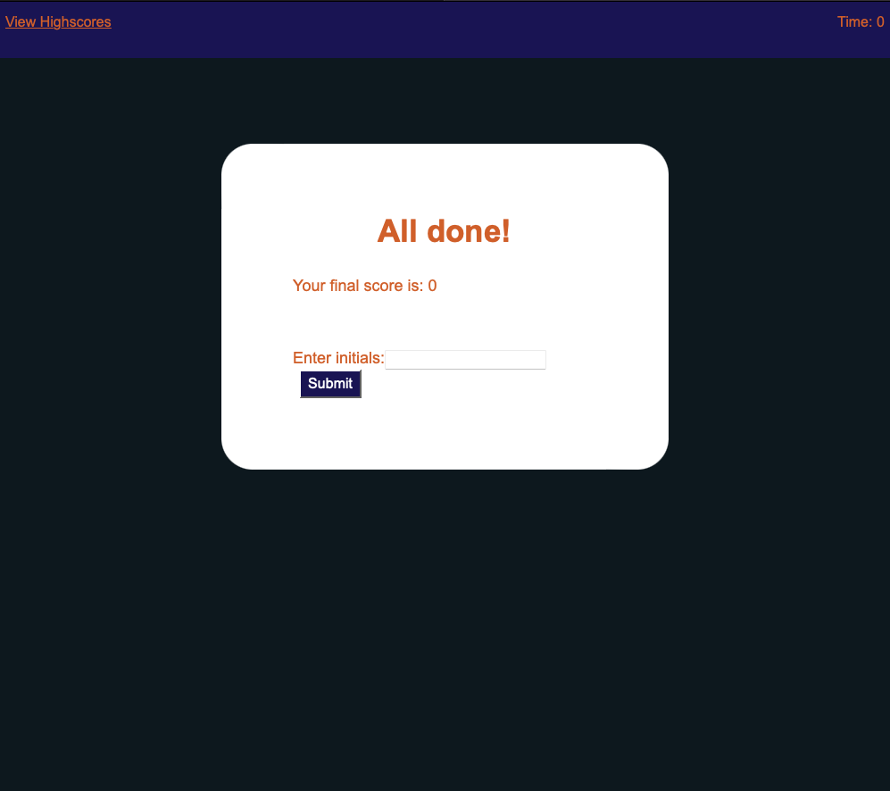

# Code Challenge 04: JavaScript Quiz

## Description

The Javascript Quiz was the fourth challenge in our web development bootcamp. It was designed to challenge us with applying 
what we had learned that week about JavaScript. Some of the new tools I used were:
- Using JQuery to traverse the DOM
- Using JQuery to create and display HTML elements
- Using event handlers and event delegation to display current information and collect user input
- Using the startTimer function to give the quiz a time limit
## Installation

N/A

## Usage

To start the quiz click the start quiz button. The quiz area display should then be updated to show the first question, a list of answers, and the time in the upper right hand corner of the page. As you hover over each answer the text color will change and the cursor style will change. Once an answer is clicked on the display should then show the next question until there are no more questions. If the answer clicked on is right then you will be awarded 2.5 points and if it is wrong you will lose 1.5 points and 10 seconds off of the time. When the quiz is over you can enter your initials. Uppon submiting your initials you will be taken to the high scores page where all your locally saved highscores will be displayed. Two clickable buttons will be displayed underneath the list, one will take you back to the main page and the other will delete your locally saved scores and the scores list will no longer be displayed. To visit the deployed application follow this link: https://https://trufl.github.io/javascript-quiz/

    

## Credits

N/A

## License

N/A